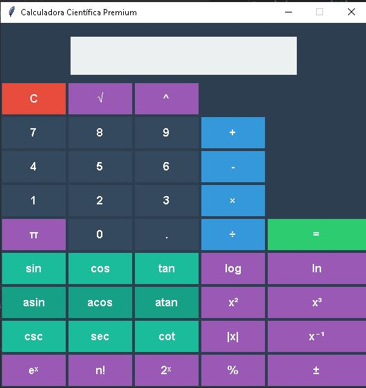

# Calculadora Científica



## 📌 Descripción

Calculadora científica avanzada desarrollada en Python con interfaz gráfica moderna, que combina operaciones básicas con funciones matemáticas complejas en un diseño intuitivo.

## 🚀 Características

### Operaciones Básicas
- ✅ Suma, resta, multiplicación, división  
- ✅ Potencias (xʸ) y raíz cuadrada (√)  
- ✅ Porcentajes (%) y cambio de signo (±)  
- ✅ Constante π (pi)  

### Funciones Trigonométricas
- 🔺 Seno/Coseno/Tangente (sin/cos/tan)  
- 🔻 Inversas (asin/acos/atan)  
- 🔄 Cosecante/Secante/Cotangente (csc/sec/cot)  

### Funciones Avanzadas
- 📊 Logaritmos (log₁₀, ln)  
- ⚡ Exponencial (eˣ)  
- ❗ Factorial (n!)  
- 🔢 Potencias de 2 (2ˣ)  
- 🔄 Inverso multiplicativo (x⁻¹)  
- ²³ Cuadrado/Cubo (x²/x³)  

## 🖥️ Tecnologías
- Python 3.10+
- Tkinter (GUI)
- Math (Funciones matemáticas)

## 🛠️ Instalación
```bash
git clone https://github.com/tu-usuario/calculadora-cientifica.git
cd calculadora-cientifica
python calculadora.py
